---

## 👨‍💻 About Me

Frontend Engineer & Full Stack Developer. I specialize in **React**, **TypeScript**, and **AI Integration**.

- 🔭 Currently building: **AI Content Studio** — local voice/text/audio/video pipeline on RTX 4060
- 💼 RSHB-Intech, CUSTIS (fintech)
- 🎯 Focus: Clean code, pixel-perfect UI, developer experience

---

## 🛠️ Tech Stack

---

## 🚀 Featured Projects

| Project | Description | Stack |
|---------|-------------|-------|
| [AI-LOCAL](https://github.com/akerbs/ai-local) | Full-cycle AI Content Studio | Python, Ollama, Docker |
| [PORTFOLIO](https://github.com/akerbs/portfolio) | Modern PWA portfolio | React, TypeScript, SCSS |
| [TG-CLOUD-STORAGE](https://github.com/akerbs/tg-cloud-storage) | Telegram cloud storage | React, TypeScript |
| [SONG-LYRICS-TRANSLATOR](https://github.com/akerbs/song-lyrics-translator) | AI lyrics translation | React, Node.js |
| [CHAIN-CHAT](https://github.com/akerbs/ChainChat) | Multi-model AI chat | React, Python |

---

## 📫 Connect with Me

  
  
  
  

